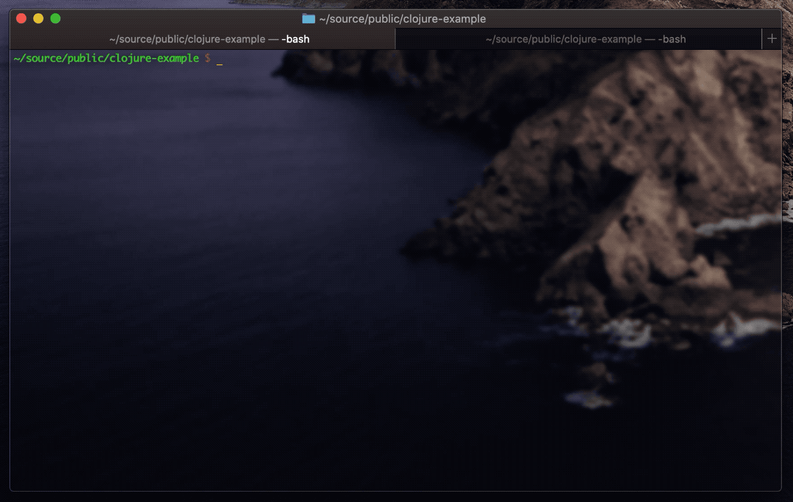

# clojure-example
Example project demonstrating how build a simple REST API with Clojure

## Getting Started
To run this project:
* Have [Clojure](https://clojure.org) installed
* Clone this repo
* `cd` into project directory

## Testing the REST API
To test out the REST API:
* Start the server with `lein run server`
* Add friends with `./post.sh '{"name":"joe","nickname":"beers","occupation":"bartender"}'`
* Retrieve list of friends with `curl localhost:3000/friends`

## Contributions
Suggestions, corrections and other ideas are welcome. Thanks!